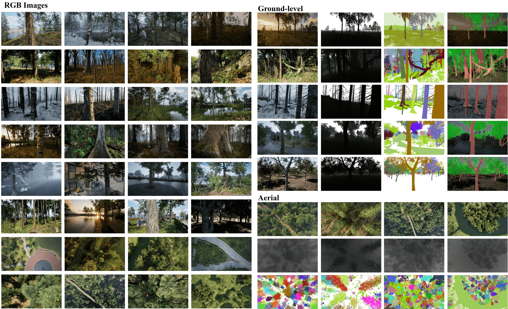
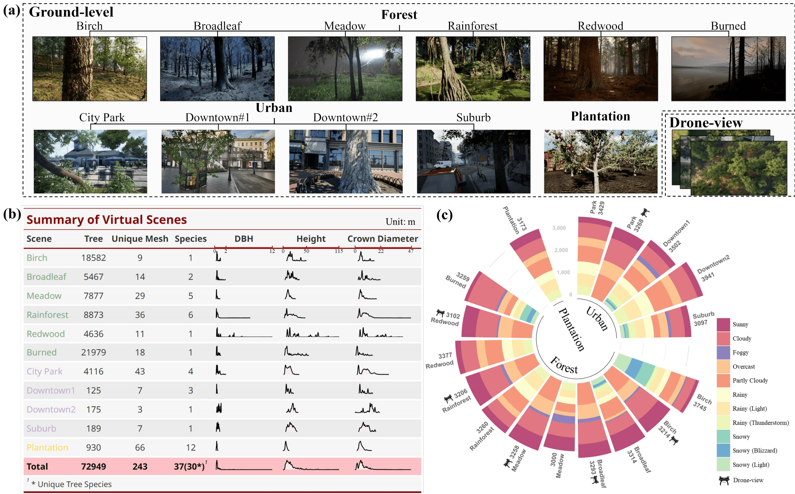

# 合成逼真树木数据集（SPREAD）

<div>
    <a align="center">
         
    </a>
    <p align="center">
        <div style="display: flex; justify-content: space-between; align-items: center;">
            <h3 style="margin: 0;">逼真的森林数据集及其数据收集框架 :evergreen_tree:</h3>
            <div>
                <a style="margin-right: 5px;">简体中文</a>
                <span>|</span>
                <a href="README.md" style="margin-left: 5px;">English</a>
            </div>
        </div>
        <br />
        <div style="display: flex; justify-content: space-between; align-items: center;">
            <a href="https://www.cambridge.org/engage/coe/article-details/657491c25bc9fcb5c9727f79">下载数据集 🌐</a>
            <a href="https://www.cambridge.org/engage/coe/article-details/657491c25bc9fcb5c9727f79">查看我们的论文 :bookmark_tabs:</a>
            <a href="https://github.com/MingyueX/GreenLens/issues">报告问题 :hammer_and_wrench:</a>
            <a href="https://github.com/MingyueX/GreenLens/issues">请求新功能 🙋</a>
        </div>
    </p>
</div>

SPREAD 是一个用于林业图像视觉任务的合成数据集。目前支持的任务包括树木检测、树木/树干分割、冠层分割、树种识别以及基于图像的关键树木参数（胸径、树高、冠幅）估算。SPREAD 包含 RGB 图像、深度图、分割图（实例+语义）、点云、关键树木参数（胸径、高度和冠幅）以及每个场景中树木的元数据（种类、位置、大小等）。数据集采集自 13 个由虚幻引擎 5 生成的逼真虚拟场景，包括森林（6 个不同的生物群系）、城市区域（4 个不同场景）和种植园。数据收集主要依赖于一个名为 [Colosseum](https://github.com/CodexLabsLLC/Colosseum) 的模拟器以及我们设计的蓝图程序。我们已开源了用于收集 SPREAD 的整个数据收集流程，允许研究人员根据其研究需求调整该框架以生成更适合的自定义数据集。


[](https://www.python.org/)

<!-- [](https://github.com/emalderson/ThePhish/blob/master/LICENSE) -->

## 目录
- [合成逼真树木数据集（SPREAD）](#合成逼真树木数据集spread)
  - [目录](#目录)
  - [数据集概览 🌲](#数据集概览-)
  - [自定义你的数据集 ⚙](#自定义你的数据集-)
    - [1. 创建你的游戏关卡](#1-创建你的游戏关卡)
    - [2. 配置 Colosseum](#2-配置-colosseum)
    - [3. 配置数据收集框架](#3-配置数据收集框架)
      - [Main\_Map 的配置](#main_map-的配置)
      - [Landscape\_Map 的配置](#landscape_map-的配置)
      - [配置哪些网格体部分被高亮](#配置哪些网格体部分被高亮)
      - [配置 Python 脚本](#配置-python-脚本)
    - [4.开始数据收集](#4开始数据收集)
  - [贡献 💪](#贡献-)
  - [许可 📖](#许可-)
  - [联系 📞](#联系-)

## 数据集概览 🌲
创建 SPREAD 的主要动机之一是解决现实世界中带注释的森林图像和森林清单数据的稀缺性。因此，我们借助虚幻引擎 5 创建了与现实世界非常相似的虚拟场景，在这些场景中收集准确的注释图像和精确的树木参数。我们考虑了树木的分布、所处背景和数据集的应用场景，从而构建了三种类型的环境：森林、城市和种植园。

在森林环境中，SPREAD 目前包括六个不同的森林场景，每个场景代表一个不同的生物群系：热带雨林、红木林、桦树林、烧枯木林、草甸林和阔叶林。对于城市环境，我们考虑了可能干扰树木检测和分割的元素，如电线杆、消防栓和复杂背景。我们构建了四个城市场景：两个不同的闹市区、一个郊区和一个城市公园。此外，我们还开发了一个种植园场景，其中果树整齐排列，在同一地块内生长和形状均匀。

在图像模态方面，SPREAD 包含了 RGB、深度图、语义分割图以及实例分割图。同时，除了近地面的样本，SPREAD 还包括了无人机视角的图像，因此支持冠层分割任务。以下是一些示例图像。



SPREAD 包含大约 37,000 个地面样本和 19,000 个无人机视图样本。每个样本包括 RGB 图像、深度图、分割图、点云、元数据和视场内所有树木的参数（树 ID、位置、胸径、高度和冠幅）。下图（b）展示了每个场景的基本信息和关键树木参数的分布。所有样本均在多达 11 种不同天气条件下采集，天气分布如下图（c）所示。



<p align="right">(<a href="#readme-top">返回顶部</a>)</p>

<!-- ## SPREAD 的有效性
我们通过树干语义分割任务展示了 SPREAD 的显著潜力。 -->

## 自定义你的数据集 ⚙

SPREAD 通过一个高度可扩展、可自定义的数据收集框架获取，你可以将这个框架用于你的自定义游戏关卡来收集 RGB、深度图以及分割图。以下步骤需要你对 UE5、蓝图以及 Python 有一定了解。

### 1. 创建你的游戏关卡

你可以在虚幻市场找到更多不可思议的、精美制作的环境资产包。你可以对这些资产包中的演示关卡进行微调，以构建一个能够使用 SPREAD 数据收集框架的新关卡。如果想要最小程度地修改数据收集框架，主要游戏关卡（假设命名为 Main_Map）需要满足以下条件：
- 关卡必须包含 Landscape，InstancedFoliageActor（石头、灌木等）、静态网格体演员（树木）以及 Ultra Dynamic Sky（一个不可思议的 [天气插件](https://www.unrealengine.com/marketplace/en-US/product/ultra-dynamic-sky)）。
- 我们强调游戏关卡中每一棵树木必须是静态网格体演员。通过 UE5 程序化生成的树木通常会以 InstancedFoliageActor 的形式存在，这种情况下，你需要将这些树木转换为静态网格体演员。你可能会发现 [MultiTool](https://www.unrealengine.com/marketplace/en-US/product/multitool-quick-batch-operations-on-assets) 对于这种转换非常有用。
- 关卡中的树木命名必须以 "Tree" 开头，并且放置在一个名为 "Tree" 的文件夹中。我们建议以 Tree0、Tree1、Tree2 这样的方式命名树木。对于这种批量命名，可以借助 [Multi Objects Renaming Tool 插件](https://www.unrealengine.com/marketplace/en-US/product/multi-objects-renaming-tool)。

此外，你还需要制作一个仅包含 Landscape 的关卡（假设命名为：Landscape_Map），这个关卡在后续用于获取地面点的信息，以确定拍摄图像时相机的高度。

如果获取上述插件或者资产包有困难，那么你可以参考 XX 进行代码或蓝图的修改，将缺失组件对应的代码或蓝图注释掉或删除。

### 2. 配置 Colosseum

我们建议参考 AirSim（Colosseum 的上一代模拟器）的 [详细文档](https://microsoft.github.io/AirSim/unreal_custenv/) 来配置 Colosseum。当你能成功在 Main_Map 中以 AirSimGameMode 运行关卡时，证明你已经成功配置了 Colosseum。

### 3. 配置数据收集框架
#### Main_Map 的配置
- 步骤 1: 将 UE_Assets 文件夹中的 BP_FunctionKit.uasset, Trunk_Highlighter.uasset, LandscapeSampler.uasset 放到你当前的 UE 项目中。
- 步骤 2: 将 BP_FunctionKit 拖入到 Main_Map 中，随后双击查看其蓝图 graph，确保其蓝图中的所有节点都正确显示。
- 步骤 3: 打开 Main_Map 的关卡蓝图，复制 [这个网址](https://www.baidu.com) 中的关卡蓝图到你的关卡蓝图中。检查关卡蓝图中的所有节点是否正确显示。如果没有，需要手动连接这些节点。至此，Main_Map 的配置已经完成。
#### Landscape_Map 的配置
- 步骤 1：将 Main_Map 中的 LandScape 复制到 Landscape_Map 中，确保 LandScape 的名字为 LandScape。
- 步骤 2: 将 LandscapeSampler 拖入到 Landscape_Map 中，双击打开它，并设置采样参数和文件保存路径。默认情况下，每隔 30cm 采样一次。
#### 配置哪些网格体部分被高亮
逐一查看关卡内所有静态网格体（树木）的资产详情，选择属于树叶部分的插槽的材质索引，并按照 "SM_Name Leaf_Material_Index" 的格式记录到 leaf_material_index.xlsx 文件中。如果你的树木有多个树叶部分，那么每个材质索引用空格隔开。

#### 配置 Python 脚本
- 步骤 1: 安装所需的所有 Python 库
```python
pip install -r requirements.txt
```
- Step 2: 修改data_collection.py文件中的参数
```python
# 修改这些参数
NUMBER_OF_SAMPLES = 3000 # 你想要收集的样本数量
MIN_CAPTURE_DISTANCE= 1 # 相机到树木的最小距离
MAX_CAPTURE_DISTANCE = 5 # 相机到树木的最大距离
CAPTURE_HIEGHT = 2 # 相机的高度
MAX_YAW_DEVIATION = 20 # 相机的最大偏航角浮动
MAX_PITCH_DEVIATION = 3 # 相机的最大俯仰角浮动
MAX_ROLL_DEVIATION = 3 # 相机的最大滚转角浮动
MAX_DISTANCE_TO_OBJECT = 200 # 这个距离之外的树木不会被记录到分割图中
```

### 4.开始数据收集
- Step 1: 运行Landscape_Map关卡，这会在你设置的路径下生成landscape_info.txt文件，其中包含了地面点的信息。
- Step 2: 退出Landscape_Map关卡，打开Main_Map关卡，以AirSimGameMode运行关卡。
- Step 3: 运行data_collection.py脚本，这会在你设置的路径下生成RGB、深度图以及分割图。
- Step 4 (可选)： 运行generate_segmentation_product.ipynb脚本，以生成语义分割图。或者说，你可以根据你的需求，从实例分割图生成其他的分割产品。


<p align="right">(<a href="#readme-top">回到顶部</a>)</p>

<!-- CONTRIBUTING -->
## 贡献 💪

贡献是让开源社区成为一个如此令人惊叹的学习、启发和创造之地的原因。你所做的任何贡献都是 极其受欢迎的。

如果你有使其变得更好的建议，请 fork 该仓库并创建一个 pull request。你也可以简单地打开一个标记为 "enhancement" 的 issue。
不要忘记给项目加星！再次感谢！

- fork 项目
- 创建你的功能分支（`git checkout -b feature/AmazingFeature`）
- 提交你的修改（`git commit -m 'Add some AmazingFeature'`）
- 推送到分支（`git push origin feature/AmazingFeature`）
- 打开一个 `pull request`

<p align="right">(<a href="#readme-top">回到顶部</a>)</p>


<!-- LICENSE -->
## 许可 📖

依据 MIT 许可分发。更多信息请参见`LICENSE.txt`。

<p align="right">(<a href="#readme-top">回到顶部</a>)</p>


<!-- CONTACT -->
## 联系 📞

我们的团队链接： [能源与环境组](https://www.cst.cam.ac.uk/research/eeg)

<p align="right">(<a href="#readme-top">回到顶部</a>)</p>


<!-- CITATION -->
<!-- ## Citation 📚
```
@article{feng2023trunk,
  title={A Trunk Diameter Estimation Mobile App for the Masses},
  author={Feng, Zhengpeng and Xie, Mingyue and Holcomb, Amelia and Keshav, Srinivasan},
  booktitle={Cambridge Open Engage. doi:10.33774/coe-2023-6z4wb-v2}
  year={2023}
}
``` -->