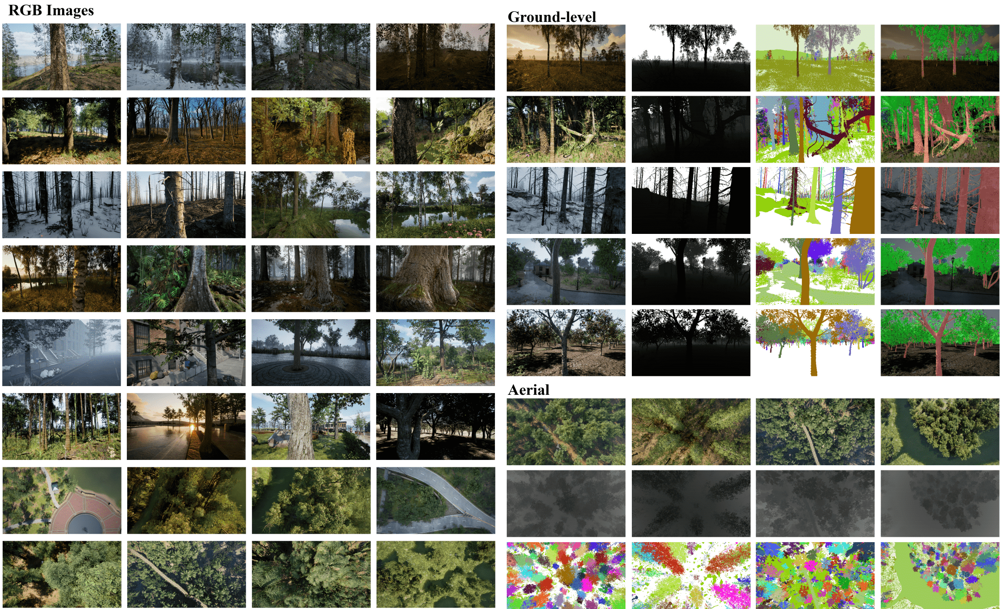
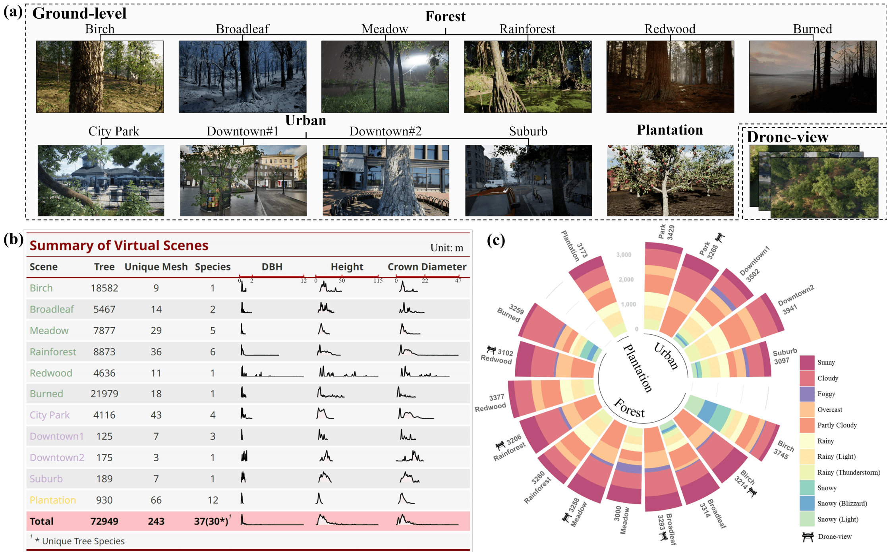

# Synthetic Photo-Realistic Arboreal Dataset (SPREAD)
<a name="readme-top"></a>
<div>
    <a align="center">
         
    </a>
    <p align="center">
        <div style="display: flex; justify-content: space-between; align-items: center;">
            <h3 style="margin: 0;">Photo-realistic forest dataset and its data collection framework :evergreen_tree:</h3>
            <div>
                <a href="README-zh.md" style="margin-right: 5px;">简体中文</a>
                <span>|</span>
                <a style="margin-left: 5px;">English</a>
            </div>
        </div>
        <br />
        <!-- 关键的布局部分 -->
        <div style="display: flex; justify-content: space-evenly; align-items: center; width: 100%;">
            <a href="https://zenodo.org/records/13570934" style="flex-grow: 1; text-align: center; padding: 0 10px;">Download Dataset 🌐</a>&nbsp;&nbsp;&nbsp;&nbsp;&nbsp;&nbsp;
            <a href="http://dx.doi.org/10.2139/ssrn.4977986" style="flex-grow: 1; text-align: center; padding: 0 10px;">View Our Paper :bookmark_tabs:</a>&nbsp;&nbsp;&nbsp;&nbsp;&nbsp;&nbsp;
            <a href="https://github.com/FrankFeng-23/SPREAD/issues" style="flex-grow: 1; text-align: center; padding: 0 10px;">Report Bug :hammer_and_wrench:</a>&nbsp;&nbsp;&nbsp;&nbsp;&nbsp;&nbsp;
            <a href="https://github.com/FrankFeng-23/SPREAD/issues" style="flex-grow: 1; text-align: center; padding: 0 10px;">Request Feature 🙋</a>
        </div>
    </p>
</div>

SPREAD is a synthetic dataset for image-based visual tasks in forestry. The currently supported tasks include tree detection, tree/trunk segmentation, canopy segmentation, tree species recognition, and image-based estimation of key tree parameters (DBH, tree height, canopy diameter). SPREAD includes RGB, depth images, segmentation maps (instance + semantic), point clouds, key tree parameters (DBH, height, and canopy diameter), and metadata for each tree in the scene (species, location, size, etc.). The dataset is collected from 13 different photo-realistic virtual scenes generated by Unreal Engine 5, including forests (6 different biomes), urban areas (4 different scenes), and plantations. Data collection heavily relies on a simulator called [Colosseum](https://github.com/CodexLabsLLC/Colosseum) and our designed blueprint program. We have open-sourced the entire pipeline used to collect SPREAD, allowing researchers to adapt this framework to create datasets more suitable for their research.


[](https://www.python.org/)

<!-- [](https://github.com/emalderson/ThePhish/blob/master/LICENSE) -->


## Table of Contents
- [Synthetic Photo-Realistic Arboreal Dataset (SPREAD)](#synthetic-photo-realistic-arboreal-dataset-spread)
  - [Table of Contents](#table-of-contents)
  - [Dataset Overview 🌲](#dataset-overview-)
  - [Get Tree Parameters ℹ️](#get-tree-parameters-ℹ️)
  - [Customize Your Dataset ⚙](#customize-your-dataset-)
    - [1. Create Your Game Level](#1-create-your-game-level)
    - [2. Configure Colosseum](#2-configure-colosseum)
    - [3. Configure Data Collection Framework](#3-configure-data-collection-framework)
      - [Main\_Map Configuration](#main_map-configuration)
      - [Landscape\_Map Configuration](#landscape_map-configuration)
      - [Configure Which Parts of Meshes Are Highlighted](#configure-which-parts-of-meshes-are-highlighted)
      - [Configure Python Scripts](#configure-python-scripts)
    - [4. Start Data Collection](#4-start-data-collection)
  - [Contributing 💪](#contributing-)
  - [License 📖](#license-)
  - [Contact 📞](#contact-)
  - [Citation 📚](#citation-)

   
## Dataset Overview 🌲
One of the primary motivations for creating SPREAD was to address the scarcity of annotated forest imagery and forest inventory data in the real world. therefore, we leveraged unreal engine 5 to create highly realistic virtual scenes that closely resemble real-world environments, where we collected accurately annotated images and precise tree parameters. we considered tree distribution, background context, and dataset application scenarios to construct three types of environments: forests, urban areas, and plantations.

For the forest environment, SPREAD currently includes six different forest scenes, each representing a distinct biome: tropical rainforest, redwood forest, birch forest, burned forest, meadow forest, and deciduous forest. for urban environments, we considered elements that could interfere with tree detection and segmentation, such as utility poles, fire hydrants, and complex backgrounds. we built four urban scenes: two distinct downtown areas, a suburban area, and an urban park. additionally, we developed a plantation scene where fruit trees are neatly arranged, growing uniformly in the same plot.

In terms of image modalities, SPREAD includes RGB, depth maps, semantic segmentation maps, and instance segmentation maps. at the same time, beyond near-ground samples, SPREAD also includes drone-view images, thereby supporting canopy segmentation tasks. some example images are shown below.



SPREAD contains approximately 37,000 ground samples and 19,000 drone-view samples. each sample includes RGB images, depth maps, segmentation maps, point clouds, metadata, and parameters for all trees within the field of view (tree ID, location, DBH, height, and canopy diameter). basic information about each scene and the distribution of key tree parameters are shown in the diagram below (b). all samples were collected under up to 11 different weather conditions, with weather distribution shown in the diagram below (c).



<p align="right">(<a href="#readme-top">back to top</a>)</p>

<!-- ## SPREAD Effectiveness
We demonstrate the significant potential of SPREAD using the example task of trunk semantic segmentation. -->

## Get Tree Parameters ℹ️
To identify the trees within a given image and retrieve their corresponding parameters, please refer to the figure below. As an example from the broadleaf dataset, the following key files can be found in the dataset uploaded to Zenodo:
- rgb/Tree0_1720149451.png
- instance_segmentation/Tree0_1720149451.png
- instance_segmentation/Tree0_1720149451.txt
- color_palette.xlsx
- obj_info_final.xlsx

.png)

To extract detailed information about all the trees in a given RGB image, follow these four steps illustrated in the figure above:
- Step 1. Extract all the RGB values from the instance segmentation map.
- Step 2. Cross-reference these RGB values with color_palette.xlsx to identify the corresponding color index.
- Step 3. Use the color index to find the tree IDs in the corresponding metadata file (.txt) under instance_segmentation folder.
- Step 4. Input the obtained tree IDs into obj_info_final.xlsx to retrieve the trees’ location information and parameters.

<p align="right">(<a href="#readme-top">back to top</a>)</p>

## Customize Your Dataset ⚙

SPREAD was collected using a highly scalable and customizable data collection framework, which you can utilize in your custom game levels to collect RGB, depth maps, and segmentation maps. the following steps require some familiarity with UE5, blueprints, and Python.

### 1. Create Your Game Level

You can find more amazing, beautifully crafted environment asset packs in the Unreal Marketplace. you can fine-tune the demo levels of these asset packs to create a new level that can use the SPREAD data collection framework. if you want to minimally modify the data collection framework, the main game level (assumed to be named Main_Map) should meet the following criteria:
- The level must include a landscape, instanced foliage actor (rocks, shrubs, etc.), static mesh actors (trees), and ultra dynamic sky and weather (an amazing [weather plugin](https://www.unrealengine.com/marketplace/en-US/product/ultra-dynamic-sky)).
- We emphasize that every tree in the game level must be a static mesh actor. trees generated procedurally in UE5 are often represented as instanced foliage actors, in which case, you need to convert these trees into static mesh actors. you may find the [MultiTool](https://www.unrealengine.com/marketplace/en-US/product/multitool-quick-batch-operations-on-assets) plugin very useful for such conversions.
- The trees in the level must be named starting with "Tree" and placed together in a folder named "Tree." we recommend naming trees as Tree0, Tree1, Tree2, etc. for batch renaming, you can use the [Multi Objects Renaming Tool plugin](https://www.unrealengine.com/marketplace/en-US/product/multi-objects-renaming-tool).

In addition, you need to create a level that only contains a landscape (assumed to be named: Landscape_Map), which will be used later to obtain ground point information, determining the camera height when capturing images.

If obtaining the plugins or asset packs mentioned above is challenging, you can refer to XX for code or blueprint modifications, annotating or removing missing components' code or blueprints.

### 2. Configure Colosseum

We recommend referring to the [detailed documentation](https://microsoft.github.io/AirSim/unreal_custenv/) of AirSim (the predecessor of Colosseum) to configure Colosseum. when you can successfully run the level in Main_Map with the AirSimGameMode, it indicates that you have successfully configured Colosseum.

### 3. Configure Data Collection Framework
#### Main_Map Configuration
- Step 1: Place the BP_FunctionKit.uasset, Trunk_Highlighter.uasset, LandscapeSampler.uasset files from the UE_Assets folder into your current UE project.
- Step 2: Drag the BP_FunctionKit into the Main_Map, then double-click to view its blueprint graph and ensure that all nodes in the blueprint are displayed correctly.
- Step 3: Open the level blueprint of Main_Map, copy the level blueprint from [this URL](https://www.baidu.com) into your level blueprint. check if all nodes in the level blueprint are displayed correctly. if not, you need to manually connect these nodes. this completes the configuration of Main_Map.
#### Landscape_Map Configuration
- Step 1: Copy the landscape from Main_Map into Landscape_Map and ensure that the landscape's name is "LandScape."
- Step 2: Drag the LandscapeSampler into Landscape_Map, then double-click it and set the sampling parameters and file saving path. by default, sampling is done every 30cm.
#### Configure Which Parts of Meshes Are Highlighted
Review the asset details of each static mesh (tree) in the level individually, select the material index for the slots belonging to the leaf parts, and record them in the leaf_material_index.xlsx file in the format "SM_Name Leaf_Material_Index." if your trees have multiple leaf parts, separate each material index with a space.

#### Configure Python Scripts
- Step 1: Install all the required Python libraries
```python
pip install -r requirements.txt
```
- Step 2: Modify the parameters in the `data_collection.py` file
```python
# Modify these parameters
NUMBER_OF_SAMPLES = 3000 # Number of samples you want to collect
MIN_CAPTURE_DISTANCE= 1 # Minimum distance from the camera to the tree
MAX_CAPTURE_DISTANCE = 5 # Maximum distance from the camera to the tree
CAPTURE_HIEGHT = 2 # Camera height
MAX_YAW_DEVIATION = 20 # Maximum yaw deviation of the camera
MAX_PITCH_DEVIATION = 3 # Maximum pitch deviation of the camera
MAX_ROLL_DEVIATION = 3 # Maximum roll deviation of the camera
MAX_DISTANCE_TO_OBJECT = 200 # Objects beyond this distance will not be recorded in the segmentation map
```

<p align="right">(<a href="#readme-top">back to top</a>)</p>

### 4. Start Data Collection
- Step 1: Run the Landscape_Map level, which will generate a landscape_info.txt file at the path you set, containing ground point information.
- Step 2: Exit the Landscape_Map level, open the Main_Map level, and run the level in AirSimGameMode.
- Step 3: Run the data_collection.py script, which will generate RGB, depth maps, and segmentation maps at the path you set.
- Step 4 (optional): Run the generate_segmentation_product.ipynb script to generate semantic segmentation maps. alternatively, you can generate other segmentation products from the instance segmentation maps according to your needs.

<p align="right">(<a href="#readme-top">back to top</a>)</p>

<!-- CONTRIBUTING -->
## Contributing 💪

Contributions are what make the open source community such an amazing place to learn, inspire, and create. Any contributions you make are **greatly appreciated**.

If you have a suggestion that would make this better, please fork the repo and create a pull request. You can also simply open an issue with the tag "enhancement".
Don't forget to give the project a star! Thanks again!

1. Fork the Project
2. Create your Feature Branch (`git checkout -b feature/AmazingFeature`)
3. Commit your Changes (`git commit -m 'Add some AmazingFeature'`)
4. Push to the Branch (`git push origin feature/AmazingFeature`)
5. Open a Pull Request

<p align="right">(<a href="#readme-top">back to top</a>)</p>


<!-- LICENSE -->
## License 📖

Distributed under the MIT License. See `LICENSE.txt` for more information.

<p align="right">(<a href="#readme-top">back to top</a>)</p>


<!-- CONTACT -->
## Contact 📞

Our Group Link: [Energy and Environment Group](https://www.cst.cam.ac.uk/research/eeg)

<p align="right">(<a href="#readme-top">back to top</a>)</p>


<!-- CITATION -->
## Citation 📚
```
@article{feng2024spread,
  title={Spread: A Large-Scale, High-Fidelity Synthetic Dataset for Multiple Forest Vision Tasks},
  author={Feng, Zhengpeng and She, Yihang and Keshav, Srinivasan},
  booktitle={SSRN: https://ssrn.com/abstract=4977986}
  year={2024}
}
```
